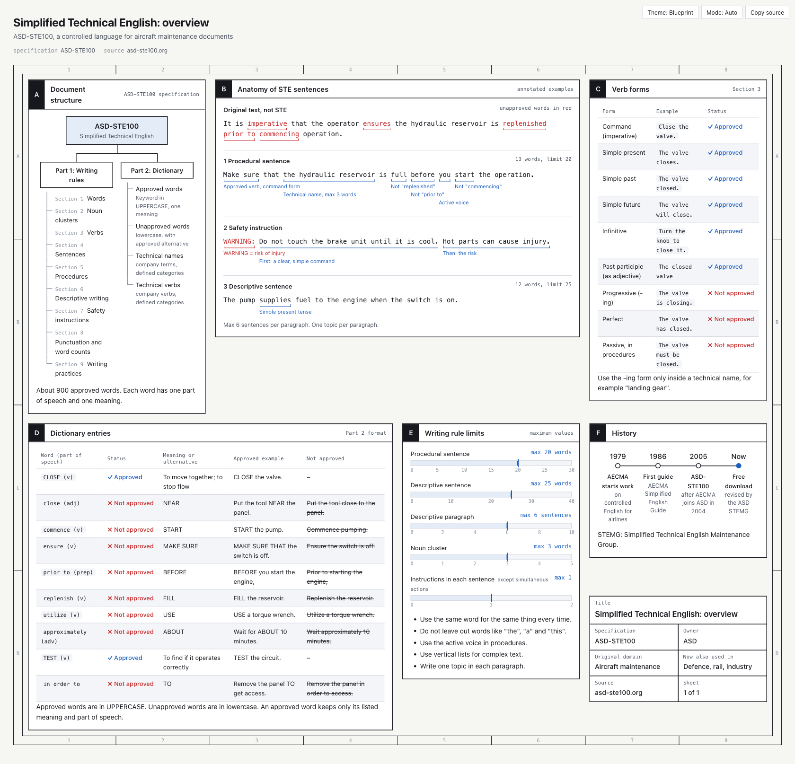
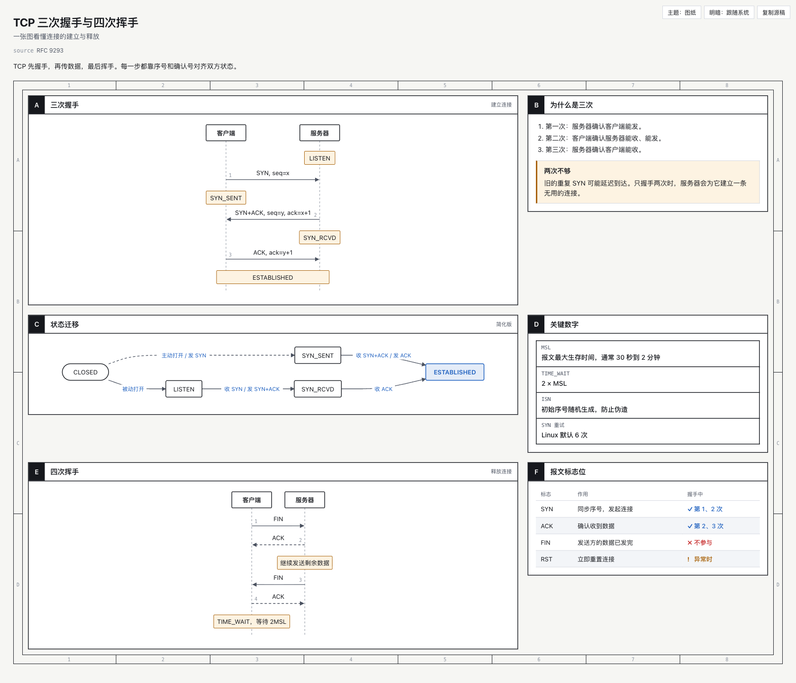
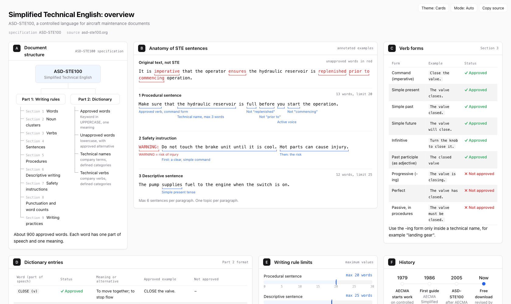
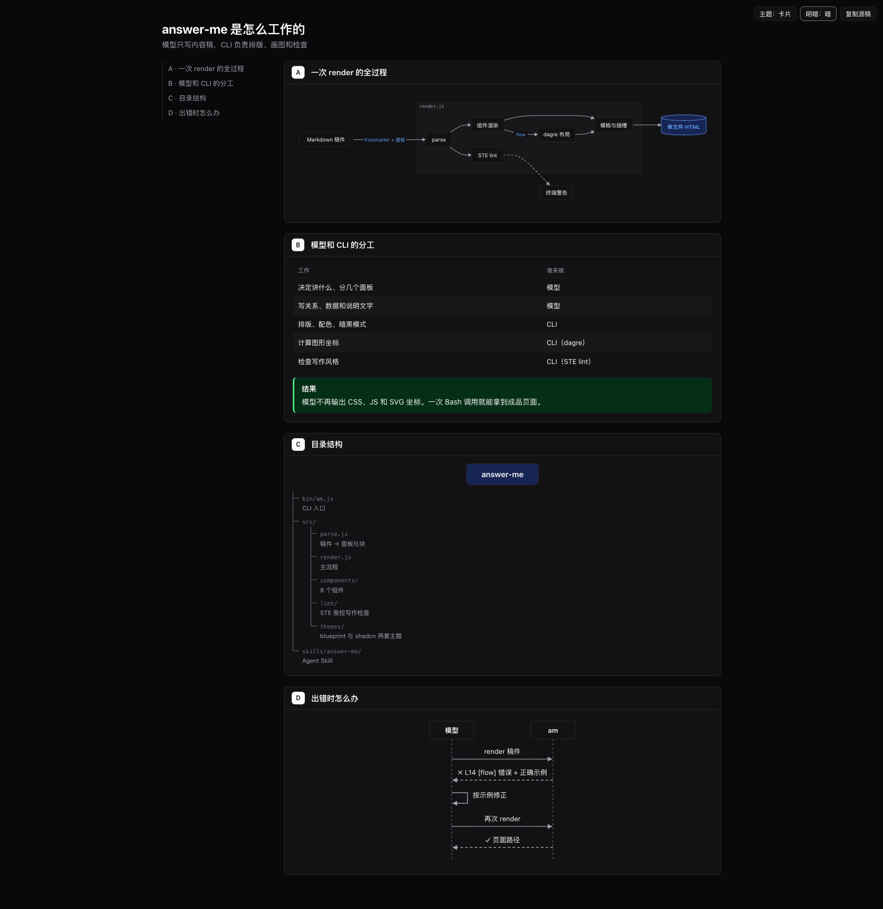

<p align="center">
  
</p>

<h1 align="center">answer-me</h1>

<p align="center">
  让 AI Agent 用一页 HTML 回答复杂问题。模型只写 Markdown，CLI 负责出页面。
</p>

<p align="center">
  <a href="LICENSE"></a>
  = 20">
  <a href="https://github.com/QingYunA/answer-me/actions/workflows/ci.yml"></a>
  
</p>

<p align="center">
  <a href="#30-秒看懂">30 秒看懂</a> ·
  <a href="#安装">安装</a> ·
  <a href="#稿件怎么写">稿件怎么写</a> ·
  <a href="#组件">组件</a> ·
  <a href="#ste-受控写作检查">STE 检查</a>
</p>

<p align="center">
  
</p>

<p align="center"><sub>上图由 <a href="examples/ste100.md">examples/ste100.md</a> 生成，复刻了 Karpathy 推文里的那张 STE100 信息板。</sub></p>

---

## 为什么做这个

Karpathy 发过[一条推文](https://x.com/karpathy/status/2105819303471976479)。大意是 LLM 干的活越来越多，人反而越来越难跟上它的输出。比起读一大段文字，看一张图、一页网页要轻松得多。

我试过让 Claude 直接用 HTML 回答问题。效果不错，就是太慢。

一页像样的网页要等一两分钟。大半时间花在输出几百行 CSS 上，而这些 CSS 每次都差不多。画流程图更麻烦：模型得自己算 SVG 坐标，连线经常歪掉，箭头指到空白处。

所以我把这些活从模型手里拿走了。模型只写内容，排版、配色、画图交给一个 CLI：

```
模型 ──(Markdown 内容稿)──▶ am render ──▶ 单文件 HTML ──▶ 浏览器
```

## 30 秒看懂

模型写这样一份稿件：

````markdown
---
title: TCP 三次握手与四次挥手
---
## A 三次握手 {span=2}
```sequence num
客户端 -> 服务器: SYN, seq=x
服务器 -> 客户端: SYN+ACK, seq=y, ack=x+1
客户端 -> 服务器: ACK, ack=y+1
note 客户端, 服务器: ESTABLISHED
```

## C 状态迁移 {span=2}
```flow LR
(CLOSED) -> LISTEN: 被动打开
LISTEN -> SYN_RCVD: 收 SYN / 发 SYN+ACK
SYN_RCVD -> *ESTABLISHED: 收 ACK
```
````

然后执行一次 `am render`，就会得到下面这页（完整稿件见 [examples/tcp.md](examples/tcp.md)）：

<p align="center">
  
</p>

时序图的间距、流程图的节点位置和连线，全部由 CLI 自动计算。

## 特性

- **模型只写内容:** 稿件就是普通 Markdown，加几种围栏块。不用写一行 CSS、JS 或 SVG。
- **图自动布局:** 流程图用 [dagre](https://github.com/dagrejs/dagre) 算坐标。时序图按标签宽度自动拉开间距，文字不会挤在一起。
- **一次调用:** 支持从 stdin 读稿件。Agent 用一个 heredoc 就能渲染完，不需要先写文件。
- **出错能自己改:** 报错会带上行号、组件名和一段正确示例。模型照着改一次就行。
- **两套主题:** blueprint 是图纸风，shadcn 是卡片风。都带亮色和暗色，页面右上角可以切换。
- **单文件、零依赖:** 产物是一个 `.html`，不引用任何 CDN 或外部字体，断网也能打开。
- **写作检查:** 按 ASD-STE100 的思路检查稿件文字，比如句子太长、用词太绕、被动语态。默认只提醒，不拦着。
- **能找回源稿:** 每页都内嵌了生成它的 Markdown，点"复制源稿"就能拿回来改。

## 安装

需要 Node.js 20 或更高版本。

```bash
git clone https://github.com/QingYunA/answer-me.git
cd answer-me
npm install
npm link          # 之后就能直接用 am 命令
```

### 作为 Agent Skill 使用

适用于 Claude Code，以及其他支持 `SKILL.md` 的 Agent：

```bash
ln -s "$PWD/skills/answer-me" ~/.claude/skills/answer-me
```

装好之后，遇到复杂问题时 Agent 会自己判断要不要出页面。比如概念之间关系复杂、有多步流程、要做多维对比的时候。它会写稿件、执行 `am render`，然后在终端只回一句结论和页面路径。

## 用法

````bash
# 渲染稿件，自动用浏览器打开
am render examples/tcp.md

# 从 stdin 读取（Agent 常用这种写法）
am render - <<'AM_EOF'
## A 一个面板
```flow
A -> B: 你好
```
AM_EOF

# 指定输出位置和主题，不自动打开
am render notes.md -o out/page.html --theme shadcn --no-open

# 只检查写作，不生成页面
am lint notes.md

# 查看所有组件，以及某个组件的写法
am list
am help flow
````

页面默认保存在 `~/.answer-me/pages/`。可以用环境变量 `ANSWER_ME_HOME` 改位置，设置 `AM_NO_OPEN=1` 就不会自动打开浏览器。

## 有多快

模型要输出的内容只有稿件。下表比较稿件和最终 HTML 的体积。最终 HTML 的体积，就是模型手写出一模一样的页面时，至少要输出的量。

| 示例 | 稿件 | 最终 HTML | 不算 CSS |
| :--- | ---: | ---: | ---: |
| [ste100](examples/ste100.md)（以文字和表格为主） | ≈1.4k tok | ≈10.8k tok（**7.8×**） | ≈5.0k tok（3.6×） |
| [tcp](examples/tcp.md)（2 张时序图 + 1 张流程图） | ≈0.6k tok | ≈9.3k tok（**16×**） | ≈3.5k tok（6.1×） |
| [architecture](examples/architecture.md)（流程图 + 时序图 + 树） | ≈0.4k tok | ≈8.4k tok（**19.5×**） | ≈2.6k tok（6.2×） |

<sub>token 数按字符比例估算，没有用真实的分词器。渲染本身每次约 50ms。</sub>

图越多，省得越多。SVG 坐标正是模型写得最慢、最容易出错的部分。

## 稿件怎么写

````markdown
---
template: sheet        # sheet 是多面板网格（默认），doc 是单栏长文加目录
theme: blueprint       # blueprint 或 shadcn
title: 页面标题
subtitle: 一句话说明
cols: 3                # sheet 的列数
source: RFC 9293       # 其他任意字段会显示在标题下方
---
导语，写一两句核心结论。

## A 面板标题 {span=2 meta="右上角的小字"}
这里写普通 Markdown，段落、列表、表格都行。
表格单元格里写 ok / no / warn，会变成 ✓ / ✗ / ! 标记。

```flow LR
A -> B: 标签
```
````

- 每个 `## ` 开头的标题是一个面板。面板编号 A、B、C 可以不写，会自动补上。
- `span=2` 让面板占两列，`rows=2` 让面板占两行，`bare` 会去掉面板的标题栏。
- 组件覆盖不到的情况，可以用 ```` ```html ```` 或 ```` ```svg ```` 直接嵌入原始代码。

完整格式见 `am help format`。

## 组件

| 组件 | 什么时候用 | 写法示例 |
| :--- | :--- | :--- |
| `flow` | 架构、调用链、决策分支 | `A -> B: 标签`、`{判断?}`、`[(数据库)]`、`group 后端: A, B` |
| `sequence` | 几方之间按时间顺序来回发消息 | `A -> B: 请求`、`B --> A: 响应`、`note A: 说明` |
| `tree` | 目录、模块、分类体系 | 用缩进表示层级，`标签 \| 说明` |
| `timeline` | 历史、版本、阶段 | `1986 \| 首版发布 \| 补充说明` |
| `limits` | 当前值和上限的对比 | `句长 \| 13 / 20 \| words` |
| `annot` | 逐词点评一句话 | `[片段]{注释}`，`[错词]{!红色注释}` |
| `kv` | 元信息、图纸标题栏 | `键: 值` |
| `callout` | 结论、提示、警告 | ```` ```callout warn 注意 ```` |

每个组件的完整写法：`am help <组件名>`。

## 两套主题

<table>
  <tr>
    <td width="50%"></td>
    <td width="50%"></td>
  </tr>
  <tr>
    <td align="center"><sub>shadcn 卡片风</sub></td>
    <td align="center"><sub>doc 模板 + 暗色模式（<a href="examples/architecture.md">examples/architecture.md</a>）</sub></td>
  </tr>
</table>

## STE 受控写作检查

[ASD-STE100](https://www.asd-ste100.org/) 是一套受控英语，最早用于写飞机维修手册。它规定了很多写法，比如句子不能太长、一个词只表达一个意思、操作步骤要用祈使句。Karpathy 提到，让 LLM 按这套规则写，读起来会清楚很多。

answer-me 把其中容易用机器检查的部分做成了中英双语版，每次渲染时顺带检查：

- **句长:** 操作步骤不超过 20 个英文词或 35 个汉字，描述性句子不超过 25 词或 45 字。每段最多 6 句。
- **用词:** 英文提示换成常见词，比如 utilize 改成 use、prior to 改成 before。中文提示删掉虚动词，比如"进行优化"直接写"优化"。
- **句式:** 提示英文被动语态、连用三个以上的"的"，以及"赋能""闭环"这类套话。

严格程度用 `style` 字段控制：`80`（默认）只提醒；`strict` 不达标就不生成页面；`off` 关闭检查。

有时你需要故意展示错误写法，可以用 `~~删除线~~`，或者放进状态为 `no` 的表格行，这些内容不会被检查。

## 开发

```bash
npm test            # 跑测试（node:test）
npm run coverage    # 看覆盖率
```

运行时依赖只有两个：[marked](https://github.com/markedjs/marked) 负责解析 Markdown，[@dagrejs/dagre](https://github.com/dagrejs/dagre) 负责流程图布局。

## License

[MIT](LICENSE)
